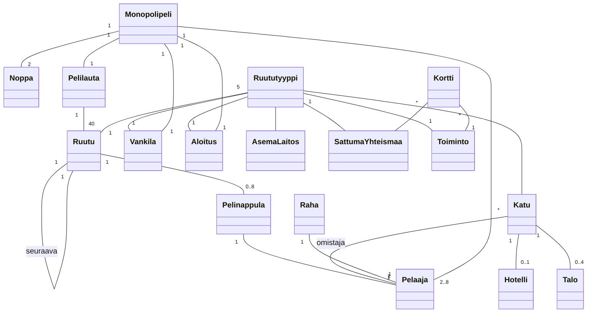

## Monopoli, alustava luokkakaavio

```mermaid
classDiagram
    Monopolipeli "1" -- "2" Noppa
    Monopolipeli "1" -- "1" Pelilauta
    Pelilauta "1" -- "40" Ruutu
    Ruutu "1" -- "1" Ruutu : seuraava
    Ruutu "1" -- "0..8" Pelinappula
    Pelinappula "1" -- "1" Pelaaja
    Pelaaja "2..8" -- "1" Monopolipeli
    Ruututyyppi "5" -- "1" Ruutu
    Ruututyyppi "" -- "1" Vankila
    Ruututyyppi "" -- "1" Aloitus
    Ruututyyppi "" -- "" Katu
    Ruututyyppi "" -- "" AsemaLaitos
    Ruututyyppi "" -- "" SattumaYhteismaa
    Ruututyyppi "1" -- "1" Toiminto
    Kortti "*" -- "1" Toiminto
    Kortti "*" -- "1" SattumaYhteismaa
    Monopolipeli "1" -- "1" Vankila
    Monopolipeli "1" -- "1" Aloitus
    Katu "1" -- "0..1" Hotelli
    Katu "1" -- "0..4" Talo
    Katu "*" -- "1" Pelaaja : omistaja
    Raha "1" -- "1" Pelaaja  
```
