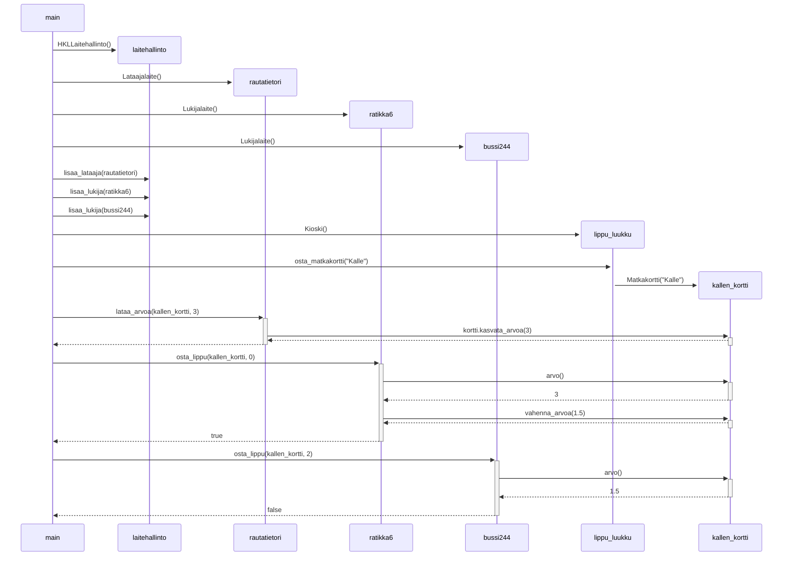

## koodin main toiminnallisuus

```mermaid
sequenceDiagram
    create participant main
    create participant laitehallinto
    main->>laitehallinto: HKLLaitehallinto()
    create participant rautatietori
    main->>rautatietori: Lataajalaite()
    create participant ratikka6
    main->>ratikka6: Lukijalaite()
    create participant bussi244
    main->>bussi244: Lukijalaite()
    main->>laitehallinto: lisaa_lataaja(rautatietori)
    main->>laitehallinto: lisaa_lukija(ratikka6)
    main->>laitehallinto: lisaa_lukija(bussi244)
    create participant lippu_luukku
    main->>lippu_luukku: Kioski()
    main->>+lippu_luukku: osta_matkakortti("Kalle")
    create participant kallen_kortti
    lippu_luukku->>kallen_kortti: Matkakortti("Kalle")
    main->>+rautatietori: lataa_arvoa(kallen_kortti, 3)
    rautatietori->>+kallen_kortti: kortti.kasvata_arvoa(3)
    kallen_kortti-->>rautatietori:
    deactivate kallen_kortti
    rautatietori-->>main:
    deactivate rautatietori
    main->>+ratikka6: osta_lippu(kallen_kortti, 0)
    ratikka6->>+kallen_kortti: arvo()
    kallen_kortti-->>ratikka6: 3
    deactivate kallen_kortti
    ratikka6->>+kallen_kortti: vahenna_arvoa(1.5)
    kallen_kortti-->>ratikka6:
    deactivate kallen_kortti
    ratikka6-->>main: true
    deactivate ratikka6
    main->>+bussi244: osta_lippu(kallen_kortti, 2)
    bussi244->>+kallen_kortti: arvo()
    kallen_kortti-->>bussi244: 1.5
    deactivate kallen_kortti
    bussi244-->>main: false
    deactivate bussi244
```